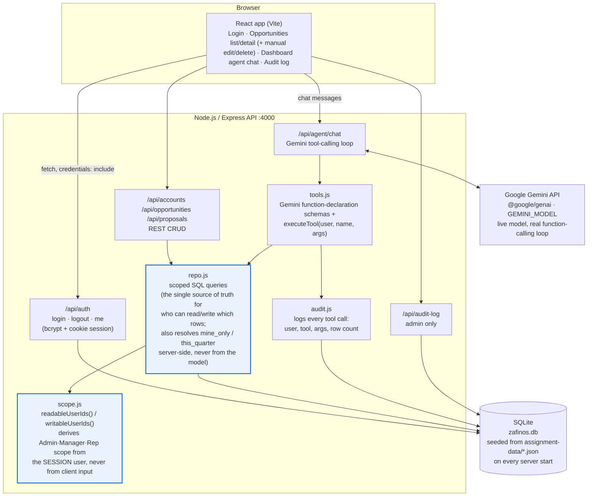

# Architecture

## Why it's shaped this way

**One scope module, one repo module, everyone goes through them.**
`scope.js` answers exactly one question — *given this signed-in user, which
user ids can they read, and which can they write?* — from the `users` table's
`role` / `manager_id` columns. `repo.js` is the only code that touches
`accounts` / `opportunities` / `proposals`, and every query in it starts from
`readScopeWhere(user)`. The REST routes call `repo.js` directly; the agent's
tools (`tools.js`) call the *exact same* `repo.js` functions. There is no
second, looser code path for the LLM — if the UI can't see a row, the agent
can't either, because they're both asking the same gate the same question.

**The agent never receives "who to look up" from the model.** The signed-in
user comes from the server-side session (`req.user`), not from the
conversation. The model can only supply *filters* (an owner name, an account
name, a stage, `mine_only`, `this_quarter`) — those filters are `AND`ed onto
the user's scope inside `repo.js`, never used to widen it. That's what makes
the permission traps work: asking about "Sam's opportunities" as Priya runs
the exact same scoped query as asking about her own, it just returns zero
rows because Sam isn't on her team.

**"My" vs "my team's" is resolved server-side, not by the model rephrasing
its own request.** Both a rep and a manager can *read* their whole team, so
without a narrower filter, "my pipeline" and "my team's pipeline" would
return identical rows. `mine_only` (boolean) tells `repo.js` to additionally
require `owner_id = <caller>` on top of the normal scope clause — it only
ever narrows an already-authorized query, so passing it can never expose
more than the caller could already see. `this_quarter` works the same way:
the server computes the actual current-quarter date bounds
(`currentQuarterRange()` in `repo.js`) and applies them as a `BETWEEN` on
`close_date`. The model is only ever asked to recognize *intent* ("this
quarter" → pass `this_quarter: true`); it never computes or supplies a date
range itself, so there's no path for a hallucinated date window to leak or
hide rows.

**Read and write are different gates.** `readableUserIds()` is "own team" for
managers *and* reps (so Priya can read Jordan's book). `writableUserIds()` is
"own team" for managers but "only yourself" for reps. Every write path —
the manual REST `PATCH`/`DELETE` routes, the React edit/delete UI that calls
them, and the write tools (bonus A, gated behind `AGENT_WRITES_ENABLED`) —
checks the write gate, not the read gate, before touching a row.

**Re-parenting is a write-scope question about a second row, not just the
first.** Updating an opportunity's own fields only needs
`canWriteOwner(user, opportunity.owner_id)`. But if the update also changes
`account_id`, the *new* account is a second row the caller is reaching into —
`repo.js` additionally checks `canReadOwner(user, newAccount.owner_id)`
before allowing the move, so a rep can't use "edit my own opportunity" as a
back door to attach it to an account outside their team. `owner_id` itself
is never accepted on update at all, for either opportunities or proposals,
which closes the simpler "just reassign ownership" bypass.

**Audit log (bonus B)** wraps every tool call - `executeTool()` is the single
choke point every tool invocation passes through, so logging lives there
once rather than being repeated per-tool.

**SQLite, seeded fresh on boot.** This is a take-home demo seeded verbatim
from `assignment-data/*.json` — there's no migration story to maintain, and
"start clean" is one command. Swapping in Postgres would mean replacing
`better-sqlite3` calls in `repo.js`/`db.js` with an async client; the scope
logic itself doesn't change.
