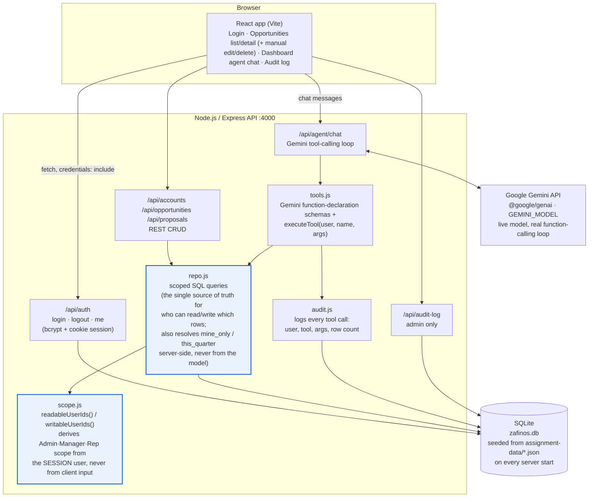

# Architecture

```mermaid
flowchart TB
    subgraph Browser["Browser"]
        UI["React app (Vite)<br/>Login · Opportunities list/detail (+ manual edit/delete) · Dashboard agent chat · Audit log"]
    end

    subgraph Server["Node.js / Express API :4000"]
        AUTH["/api/auth<br/>login · logout · me<br/>(bcrypt + cookie session)"]
        REST["/api/accounts /api/opportunities /api/proposals<br/>REST CRUD"]
        AGENT["/api/agent/chat<br/>Gemini tool-calling loop"]
        AUDITR["/api/audit-log<br/>admin only"]

        SCOPE["scope.js<br/>readableUserIds() / writableUserIds()<br/>derives Admin·Manager·Rep scope from<br/>the SESSION user, never from client input"]
        REPO["repo.js<br/>scoped SQL queries<br/>(the single source of truth for<br/>who can read/write which rows;<br/>also resolves mine_only / this_quarter<br/>server-side, never from the model)"]
        TOOLS["tools.js<br/>Gemini function-declaration schemas +<br/>executeTool(user, name, args)"]
        AUDITL["audit.js<br/>logs every tool call:<br/>user, tool, args, row count"]
    end

    DB[("SQLite<br/>zafinos.db<br/>seeded from assignment-data/*.json<br/>on every server start")]

    GEMINI["Google Gemini API<br/>@google/genai · GEMINI_MODEL<br/>live model, real function-calling loop"]

    UI -- "fetch, credentials: include" --> AUTH
    UI --> REST
    UI -- "chat messages" --> AGENT
    UI --> AUDITR

    AUTH --> DB
    REST --> REPO
    AGENT --> TOOLS
    TOOLS --> REPO
    TOOLS --> AUDITL
    REPO --> SCOPE
    REPO --> DB
    AUDITL --> DB
    AUDITR --> DB

    AGENT <--> GEMINI

    style SCOPE fill:#e9f0fe,stroke:#0f5fd6,stroke-width:2px
    style REPO fill:#e9f0fe,stroke:#0f5fd6,stroke-width:2px
```